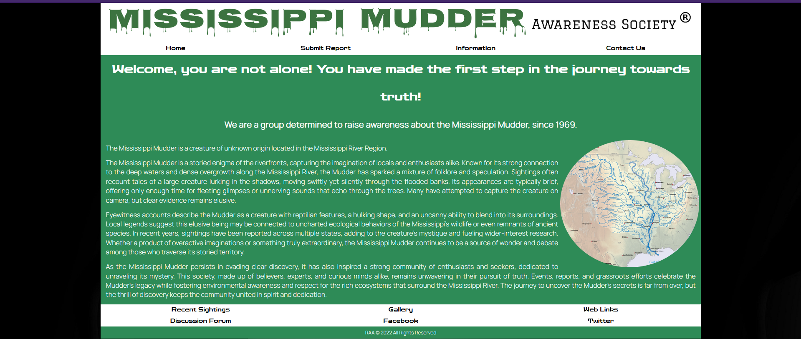
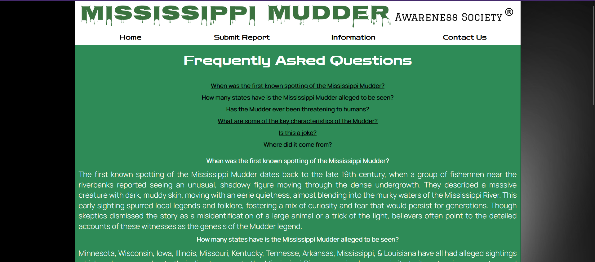

# Mississippi Mudder Awareness Society Website
A continuation of a class project from December 2022

#### By Rachel Allen

## Overview
Welcome to the **Mississippi Mudder Awareness Society Website**, a platform dedicated to raising awareness about the legendary Mississippi Mudder. This site maps sightings, shares information, and connects enthusiasts of this mysterious creature. Whether you’ve had a sighting or are simply curious, this project has you covered.

## Features
1. **Home Page**: Provides an introduction to the Mississippi Mudder and its history. The homepage includes brief information about the society and a linked map for visual enthusiasts.
2. **Submit a Sighting**: Allows users to report their sightings, inputting necessary details such as location, time, and a description of the event.
3. **FAQ**: Frequently asked questions address general curiosities about the Mississippi Mudder.
4. **Recent Sightings**: A table featuring past reported sightings, helping users track patterns and timelines.
5. **Gallery**: A curated visual showcase with cryptid-inspired imagery.
6. **Contact Us**: Provides contact details and a live countdown to the next **Mudder Con**.

## Technology Stack
This project utilizes:
- **HTML**: For structure and content.
- **CSS**: Includes stylesheets for aesthetic presentation and responsiveness.
- **JavaScript**: Used for dynamic features, such as the countdown timer.

## Pages
Below is a breakdown of each page:

### Home (`FinalProject.html`)
- **Functionality**: Serves as the landing page with an introduction to the society, a short blurb about the Mudder, and a featured map.
- **Styling**: Styled through `home_styles.css` with responsive elements for various devices.
  

### Sighting Reporter (`SightingReporter.html`)
- **Key feature**: A form for visitors to submit sightings, collecting:
  - Date and time of the sighting.
  - Location details (address, city, state, zip-code).
  - An encounter description.
  - Optional contact information for follow-ups.
- **Validation**: Input fields require validation (e.g., proper date formats, pattern matching for zip codes and phone numbers).
- **Styling**: Design driven by `sighting_styles.css`.
  

### FAQ (`MoreInfo.html`)
- **Content**: Answers common questions in a user-friendly format, with anchor links for quick navigation.
- **Styling**: Structured using `faq_styles.css` to ensure clear readability.
  

### Recent Sightings (`RecentSightings.html`)
- **Content**: Displays a table of previous sightings, detailing:
  - Date, time, location, and a description of sightings.
- **Styling**: Fully responsive layout designed through `recent_sightings_styles.css`.
  

### Gallery (`Gallery.html`)
- **Functionality**: Features a sleek gallery of cryptid-themed images using modern CSS techniques.
- **CSS Effects**:
  - **Hover Effects**: Images expand on hover.
  - **Filters**: Custom image filters for a dramatic aesthetic.
- **Styling**: Managed by `gallery_styles.css`, with shared base styles imported from `base_styles.css`.
  

### Contact Us (`ContactUs.html`)
- **Features**:
  - Provides email, phone contact options, and a live countdown (via JavaScript) to the next Mudder Con.
- **Styling**: Guided by `contact_styles.css`.
  

## Shared Stylesheets
1. **`reset_styles.css`**: Resets browser default styles for consistency.
2. **`base_styles.css`**: Contains shared foundational styles across all pages (e.g., header, footer).

## Responsive Design
The website is fully responsive, catering to:
- **Desktop and Tablet Users**: Styled elements like sidebar links and detailed navigation menus.
- **Mobile Users**: Optimized view with mobile-specific structures, including float adjustments and font scaling.
  

## How to Use
1. Navigate through the header menu available on every page.
2. Use the **Submit a Sighting** page to report any encounters.
3. Explore the FAQ and gallery to immerse yourself in the society's shared history.
4. Stay updated on Mudder events via the **Contact Us** page countdown.

## Countdown Timer
- The **Contact Us** page features a JavaScript-powered countdown timer to **Mudder Con**, dynamically calculating remaining time until the defined event date.

## Credits
- **Development & Design**: Rachel Allen
- **Course**: IS139 450, December 2022
- **Acknowledgments**: Image authors and contributors on Wikimedia Commons. Relevant credits and licenses are provided within the gallery page.

---

Explore the mystery. Report your sightings. Join the Mississippi Mudder Awareness Society!
